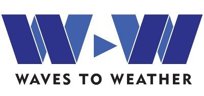

Welcome to Enstools-Encoding's documentation! |docsbadge|
=================================================
**enstools-encoding** is a minimal set of interfaces to convert a string compiling with a **Compression Specification Format**
to the arguments that are actually needed to write files compressed with **hdf5 filters** from **h5py**, **h5netcdf** or **xarray**.

This package was extracted from `enstools <https://github.com/wavestoweather/enstools>`_, and it's a key piece of `enstools-compression <https://github.com/wavestoweather/enstools-compression>`_.

It has been developed within the framework of **Waves to Weather** [1]_.

.. |docsbadge| image:: https://readthedocs.org/projects/enstools-encoding/badge/?version=latest
    :target: https://enstools-encoding.readthedocs.io/en/latest/?badge=latest
    :alt: Documentation Status

.. grid:: 2

    .. grid-item-card::
        :columns: 5

        .. image:: ./images/icons/getting_started.svg
            :width: 50%
            :alt: Alternative text
            :align: center

        .. button-ref:: quick-start
            :expand:
            :color: secondary
            :click-parent:

            Quick Start!

    .. grid-item-card::
        :columns: 5

        .. image:: ./images/icons/user_guide.svg
            :width: 50%
            :alt: Alternative text
            :align: center

        .. button-ref:: user-guide
            :expand:
            :color: secondary
            :click-parent:

            To the User Guide

    .. grid-item-card::
        :columns: 5

        .. image:: ./images/icons/api.svg
            :width: 50%
            :alt: Alternative text
            :align: center

        .. button-ref:: api
            :expand:
            :color: secondary
            :click-parent:

            To the API

    .. grid-item-card::
        :columns: 5

        .. image:: ./images/icons/contributor.svg
            :width: 50%
            :alt: Alternative text
            :align: center

        .. button-ref:: contribute
            :expand:
            :color: secondary
            :click-parent:

            Want to contribute?

.. toctree::
    :caption: Enstools-Encoding
    :maxdepth: 1
    :hidden:

    quick-start.rst
    user-guide.rst
    api.rst
    contribute.rst

.. toctree::
    :caption: Related packages
    :hidden:

    Ensemble Tools <https://enstools.readthedocs.io>
    Ensemble-Compression <https://enstools-compression.readthedocs.io>

.. [1] Waves to Weather - Transregional Collaborative Research Project (SFB/TRR165) https://wavestoweather.de  |w2wlogo|
